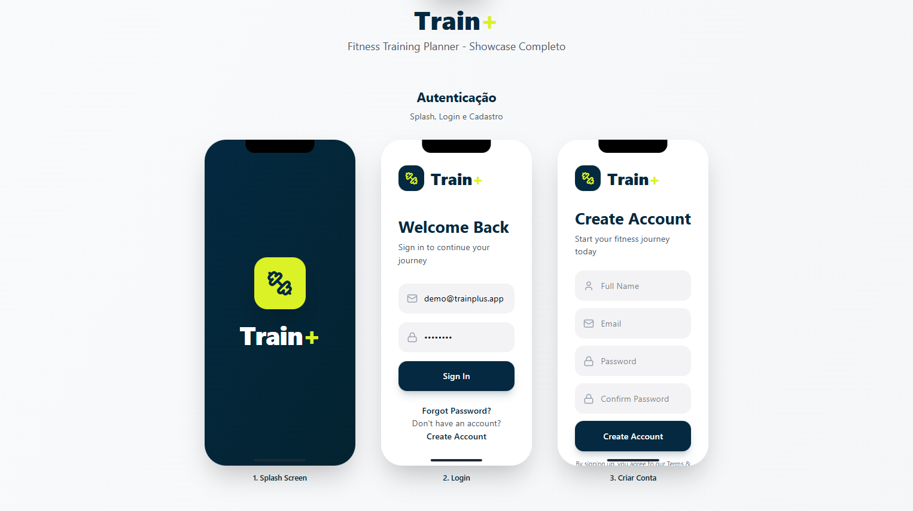
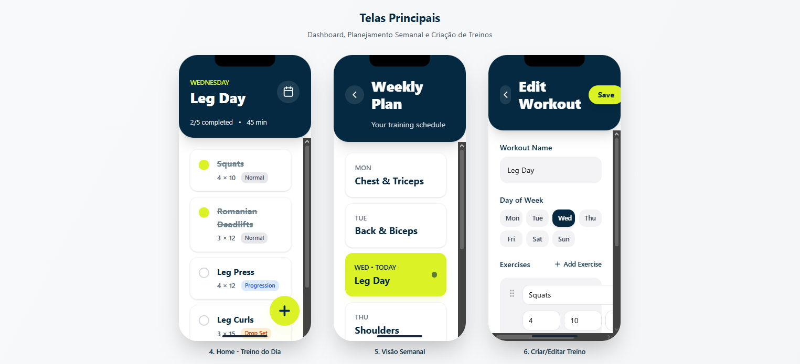
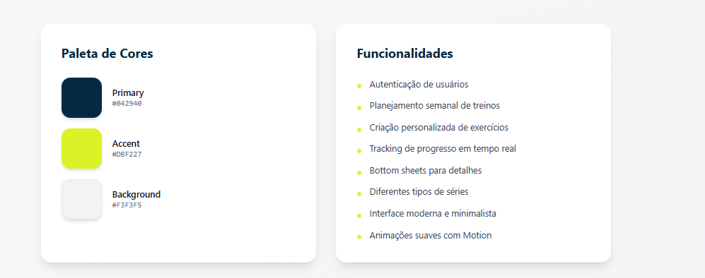

# Train+ - Fitness Training Planner

Train+ is a modern Android application designed to help users track their daily and weekly workout
routines. Built with a focus on reliability and user experience, it features an **Offline-First**
architecture with automatic synchronization.

## 📱 Showcase

<div align="center">
  
  
  
</div>

## 🚀 Features

- **Authentication**: Secure Login and Sign Up powered by Firebase Auth.
- **Home Dashboard**: View today's exercises and track progress in real-time.
- **Weekly Planning**: Overview of your entire training week.
- **Workout Editor**: Create and customize workouts, add exercises, and reorder them with
  drag-and-drop.
- **Offline-First**: All data is saved locally first. Work even without an internet connection.
- **Auto-Sync**: Background synchronization using WorkManager to keep your data safe in the cloud (
  Firebase Firestore).
- **Modern UI**: Clean and intuitive interface built entirely with Jetpack Compose.

## 🛠️ Tech Stack

- **Language**: [Kotlin](https://kotlinlang.org/)
- **UI Framework**: [Jetpack Compose](https://developer.android.com/jetpack/compose)
- **Architecture**: MVVM (Model-View-ViewModel) + Clean Architecture
- **Dependency Injection**: [Koin](https://insert-koin.io/)
- **Local Database**: [Room](https://developer.android.com/training/data-storage/room)
- **Backend/Cloud**: [Firebase](https://firebase.google.com/) (Firestore & Auth)
- **Background Tasks
  **: [WorkManager](https://developer.android.com/topic/libraries/architecture/workmanager)
- **Concurrency**: Coroutines & Flow

## 🏗️ Architecture

The project follows Clean Architecture principles, divided into three main layers:

1. **UI (Presentation)**: Jetpack Compose screens and ViewModels.
2. **Domain**: Business logic, Use Cases, and Repository interfaces.
3. **Data**: Repository implementations, Local Data Sources (Room), and Remote Data Sources (
   Firestore).

## 📥 Installation

1. Clone the repository:
   ```bash
   git clone https://github.com/vitorcsouza/train.git
   ```
2. Open the project in **Android Studio**.
3. Connect your Firebase project:
    - Add `google-services.json` to the `app/` directory.
    - Enable Email/Password Auth in Firebase Console.
    - Enable Cloud Firestore.
4. Build and run the app on an emulator or physical device.

## 📄 License

This project is licensed under the MIT License - see the [LICENSE](LICENSE) file for details.

---
Developed by [Vitor Souza](https://github.com/vitorcsouza)
